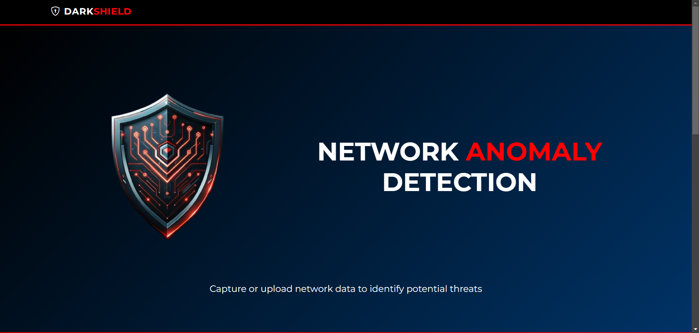
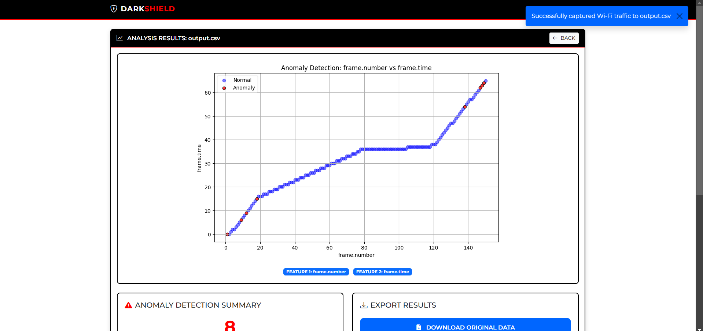
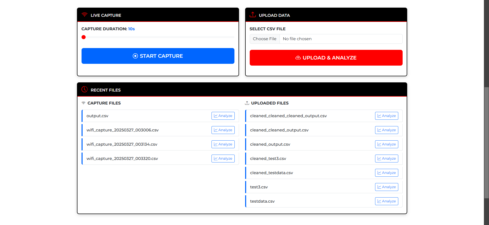
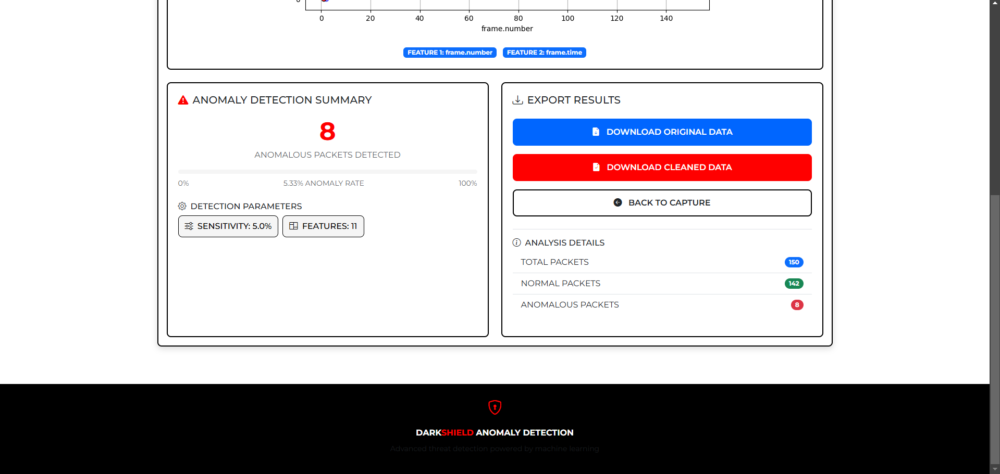

# DarkShield - Network Anomaly Detection System

<div align="center">
  
</div>

DarkShield is a powerful network anomaly detection system that uses machine learning to identify suspicious network activity in real-time or from captured data.

## Features

- 🕵️‍♂️ Real-time network traffic capture and analysis
- 📊 Interactive visualization of detected anomalies
- ⚙️ Customizable detection sensitivity
- 📁 Support for both live capture and CSV file uploads
- 📈 Detailed statistical analysis of network traffic
- 💾 Export capabilities for both raw and cleaned data

## Technology Stack

- **Backend**: Python (Flask)
- **Machine Learning**: Scikit-learn (Isolation Forest)
- **Frontend**: Bootstrap 5, HTML5, CSS3
- **Data Capture**: Wireshark/tshark
- **Visualization**: Matplotlib, Seaborn

## Installation

### Prerequisites

- Python 3.8+
- Wireshark (for live capture functionality)
- pip package manager

### Setup
Clone the repository:
   ```bash
   git clone https://github.com/rt-aryan/darkshield.git
   cd darkshield
```
Create and activate a virtual environment:
```
python -m venv venv
```
source venv/bin/activate                    # On Windows use `venv\Scripts\activate`

Install dependencies:

```pip install -r requirements.txt```

Configure Wireshark path (if needed):

Edit app.py and update the find_tshark() function if your Wireshark installation is in a non-standard location

Run the application:
python app.py

Access the web interface at:
http://localhost:5000

Choose your analysis method:
Live Capture: Capture network traffic in real-time
File Upload: Analyze existing CSV data

View and interpret the results:
Anomaly detection statistics
Interactive visualizations
Export options for further analysis

Configuration
Customize detection parameters in app.py

# Features to analyze (modify in preprocess_data function) 
Project Structure
darkshield

├── app.py

├── templates

│   ├── analyze.html

│   └── index2.html 

├── uploads

├── captures

├── requirements.txt   

└── README.md             

## Screenshots

<p align="center">
  
  
  
  
</p>

## PPT Link

https://docs.google.com/presentation/d/1b4vkjzCF4VRac1qBRPf-IxMlRxKbYCkc/edit?usp=sharing&ouid=107890533107002627806&rtpof=true&sd=true

## Demo Video Link

https://drive.google.com/file/d/1E_p5_7VDXlxlrQupKH11vAVyfGCkyvaV/view?usp=sharing

## Troubleshooting
Issue: Tshark not found
Solution: Install Wireshark or update the path in app.py

Issue: File upload fails
Solution: Ensure files are in CSV format and <10MB

Issue: Visualization not loading
Solution: Check browser console for errors and ensure JavaScript is enabled

### Contributing
Contributions are welcome! Please open an issue or submit a pull request.

### Contact
For questions or support, please contact:
Email : aryan.routray2023@vitstudent.ac.in
